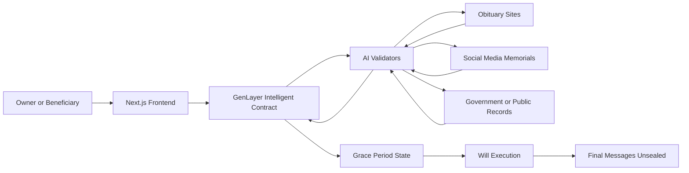
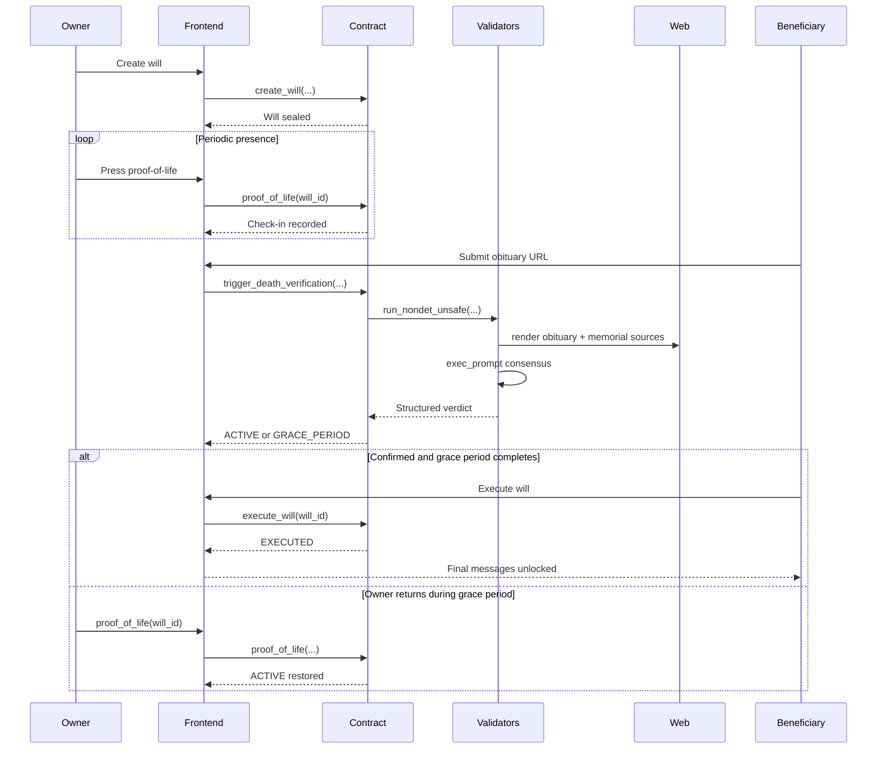
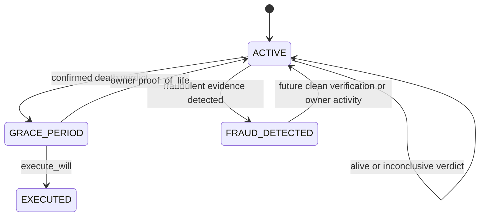

# AfterLife Architecture

## System Overview

## Lifecycle Sequence

## Smart Contract State Diagram

## Three-Layer Verification Architecture

### Layer 1: Proof of life

- Owner must check in every 30, 60, or 90 days
- Missing three cycles is the trigger for scrutiny
- This prevents immediate execution based on silence alone

### Layer 2: AI death verification

- Beneficiary submits obituary URL
- GenLayer validators render the obituary page natively
- Validators optionally inspect linked social profiles for memorial signals
- AI returns one of four bounded verdicts:
  - `CONFIRMED_DEAD`
  - `ALIVE`
  - `INCONCLUSIVE`
  - `FRAUD_DETECTED`

### Layer 3: Grace period

- A confirmed verdict does not execute immediately
- The will enters a 14-day reversible state
- Owner proof-of-life can cancel execution during the grace window

## Privacy Model

| Data Type | On-chain | Encrypted | Off-chain |
| --- | --- | --- | --- |
| Will metadata | Yes | Optional in future | No |
| Beneficiary addresses | Yes | No | No |
| Final message payloads | Demo: plain JSON | Production: yes | Optional |
| Photo/video links | Reference only | Recommended | Yes |
| Obituary and social evidence | No persistent raw storage | N/A | Read at verification time |

## Comparison

| Solution | Verifies death itself | Reversible | Trust assumptions |
| --- | --- | --- | --- |
| AfterLife | Yes, via GenLayer AI + web access | Yes | Validator consensus |
| Safe Haven style dead-man's switch | No | Weak | Timer or operator |
| Sarcophagus style access release | No true death check | Partial | Embalmers / network actors |
| Traditional wills | Human court process | Slow | Lawyers, probate, local law |

## Frontend Architecture

- `app/`: App Router pages for landing, creation, owner dashboard, verification, claims, and messages
- `components/`: reusable cards, badges, countdowns, envelopes, and the verification modal
- `lib/mockWills.ts`: seeded demo data with four narrative paths
- `lib/store.ts`: Zustand store with persistence, simulation logic, and execution actions

## Contract Notes

- All GenLayer deployment constraints from the brief were preserved
- Storage uses `TreeMap` fields only
- Public method signatures avoid `float`
- All `gl.nondet.*` calls are wrapped in `gl.vm.run_nondet_unsafe(...)`
